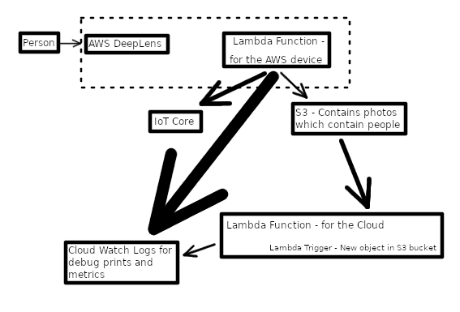

# aws-deeplens-tutorial

This repo contains notes regarding the official AWS tutorial for AWS Deeplens [here](https://www.awsdeeplens.recipes/300_intermediate/310_worker_safety/).

The repo focuses on the intermediate example which has the following design.  In this design, a person is in front of the camera.  The camera has an associated lambda function and ML model.  The lambda function predicts if the camera has a image containing a person.  If the predicted probability is greater than a specified threshold then the image is copied to S3.  When the image is put in S3, it triggers another lambda function which uses AWS Rekognition to determine which objects are in the picture.  Depending upon if a person and a hat is predicted and they are in proper spatial orientation then the system identifies a person wearing a safety hat.  The results are stored as metrics.  Both lambda function use IoT Core to repot events.




## Registering the aws deeplens device

Notes regarding registering the device to your AWS account are [here](device_registration_notes.md).


## Operational Notes on the device

Notes regarding what occurs via the ssh console connection to the device.  These notes show what processes are running during operation.  It can be helpful to understand what is happening during code updates and debugging.   The log messages on the device are mirrored in the logs in AWS console.  See [here.](deeplens_device_notes.md)


## Beginner tutorial
Beginner note are [here](beginner.md).

## Intermediate Tutorials

### The HardHat Demo Deepdive

We followed along with the official demo and took notes regarding the intermediate example.  The intermediate example shows how to load a model on deeplens which uploads images of people to AWS S3 storage.  These images trigger a lambda function to generate metrics regarding the number of people seen by the camera and wether these people are wearing hard hats.

The notes are [here.](intermediate/hardhat-safety/hard-hat-safety.md)

The lambda function which runs in AWS and is triggered by the addition of new images in S3 is [here.](cloud-function)

The lambda function which run on the camera is [here.](deeplens-function)  This code is associated with the object detection model.

### Coffe Consumption Demo Deepdive

This example uses facial recognition to track coffee consumption.


The notes are [here.](intermediate/coffee-consumption/README.md)

### Tintermediate tutorial 3

TODO


## AWS credentials

This project requires credentials which I would like to keep private but I also want to keep these files in one place with the notes on the deeplens.  In order to protect the credentials the files are stored in a encrypted file.   

The file is encrypted using gpg.  The file is in the .gitignore so that it will not be uploaded unencrypted by mistake.  It was created via this command

```
gpg --output aws-account.md.gpg --encrypt --recipient davisjf@gmail.com aws-account.md
```

To decrypt the file use this command

```
gpg --output aws-account.md --decrypt aws-account.md.gpg

```
