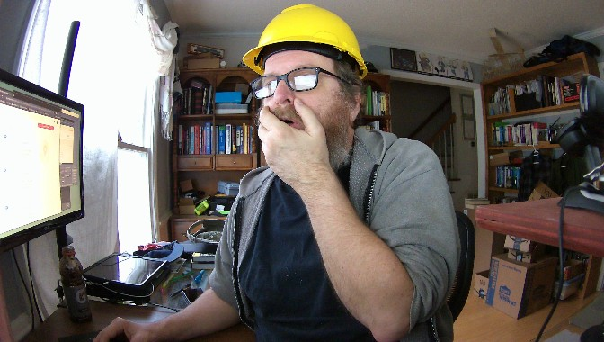
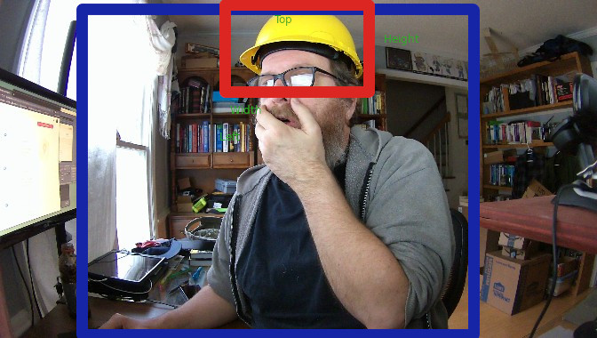

this is the S3 bucket triggered function.  It has the environment varialbe for the pub/sub topic iot_topic.

## Notes

official guide for packaging code is here
https://docs.aws.amazon.com/lambda/latest/dg/python-package.html#python-package-dependencies

### Fixing the SSL problem in lambda.
The lambda function at some point failed to publish to AWS IOT IOT pub/sub thing.
This stackoverpost describes the problem: https://stackoverflow.com/questions/65983451/how-to-fix-error-with-ssl-certificate-in-aws-lambda

This is the solution method.

1.  Create a requirements.txt file with the following line `certifi==2020.11.8`
2.  Ensure that python version used on local workstation is the same as for the cloud lambda.  
    ```
    $ python3 --version
    Python 3.7.3
    ```
3.  In the cloud function source directory on your local box create a virtual environment.

    ```
    $ python3 -m venv .
    ```
4.  Activate the virtual environment
    ```
    $ cd "the cloud lambda function source dir"
    $ source bin/activate
    ```
5.  Install the required library with a specific version as shown in the requirement.txt to the current directory.  This will install new directories.
    ```
    $ pip install -r requirements.txt -t .
    ```
6.  Create a zip file of the contents.
    ```
    $ rm foo.zip # in case a foo.zip file already exists"
    $ zip -r foo.zip *
    Better version so you don't upload the image in the source
    zip -r foo.zip bin certifi certifi-2020.11.8.dist-info/ cloud-lambda.py include/ lib lib64 pyvenv.cfg requirements.txt share

    ```
7.  Upload the zip file as the source in lambda.
8.  Adjust the entry point to match function_name.entry_poiont_function.  In this case, its cloud-function.lambda_handler


### Notes on the source

Calling graph

```
   lambda_handler 
      |
      +--> detectWorkerSafety(bucketName, imageName, imageWidth, imageHeight)
               |
               +-> rekognition = boto3.client('rekognition', region_name='us-east-1')
               +-> rekognition.detect_labels( parameters specify image location in S3, number of labels to return, minimum confidence for a particular label.)
               +-> getPersonsAndHardhats(labelsResponse, imageWidth, imageHeight)
                         |
                         +->  This function performs no calls. It simply matches up bounding boxes.
```


* in the getPersonsAndHardhats these are the image parameters

imageWidth 672.0
imageHeight 380.0

Here is the sample image and the results from the log




Here is the overlay boxes from the log output




Here are the results from log

```
Image url	https://davisjf-worker-safety.s3.amazonaws.com/persons/2_14/13_27/1613327251_0.jpg					
						
width	672					
height	380					
		normalized	actual			
person	width	0.6184347868	415.5881767			
	height	0.9715360999	369.183718			
	left	0.1381736994	92.85272598			
	top	0.0258322861	9.81626872	<- this means fourth quadrant		
						
hat	width	0.2140547186	143.8447709			
	height	0.2894132137	109.9770212			
	left	0.3769349754	253.3003035			
	top	0.02562506869	9.737526104			

```

We examined the bounding boxes in detail.  These are shown in some handwritten notes.  These notes cover how to pair an identified person with an identified hat or helmet.  We adjusted the code to give a tighter response.  For instance, the code was tolerant enough to identify a person as wearing a hardhat when they were simply holding the hat near their waist or above their head.  On a first pass we made it so that the hat would need to be held chest level or higher on the bottom end.


Handwritten notes regarding the matching code are
1. [first page](../pics/boundingboxes-1.jpeg)
1. [second page](../pics/boundingboxes-2.jpeg)
1. [third page](../pics/boundingboxes-3.jpeg)


